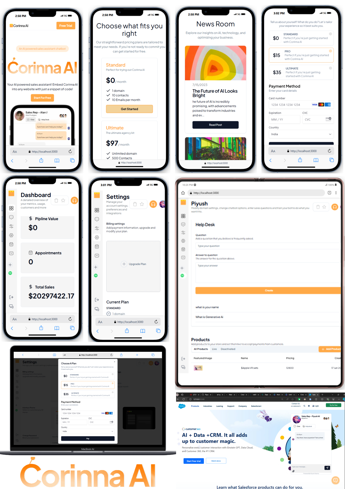
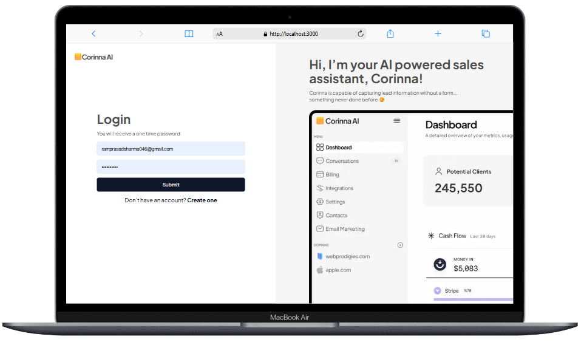

# Corinna Ai || SWIFT-AI Project

Live Demo Link = https://swiftaichat.vercel.app/

#### Demo Images



## Features

- 🤖 Automated AI sales rep (AI chatbot)
- 📅 Books appointments and processes payments
- 💻 Usable on any website with a simple code
- 🧠 Smart question linking
- 💬 Real-time chat (manual/automated)
- 🏷️ White-labeling options
- 🎨 Customizable interface
- 🗓️ Calendar widget for bookings
- 💳 Integrates with Stripe devdevelopers test API for payments
- ✉️ Simple email marketing
- 💰 Financial dashboard
- 💾 Save visitor info as leads
- 🔐 Custom login/signup with OTP
- 📲 Secure file/image uploads
- 🔍 SEO optimized blogging
- 🏗️ Improved architecture
- 🖥️ Minimal, stunning UI
- ❓ FAQ section
- 🌓 Light/dark mode toggle
- ⚙️ Feature control settings
- 🔒 Restrict features by plan

### Customise Login and Sign Up Page



## use platform

- UploadCare
- Neon Serverless Postgres
- Nodemailer
- Pusher
- OpenAi 
- Clerk auth
- Stripe (only test api)

## Getting Started

First, run the development server:

```bash
npm install

npm run dev

```

